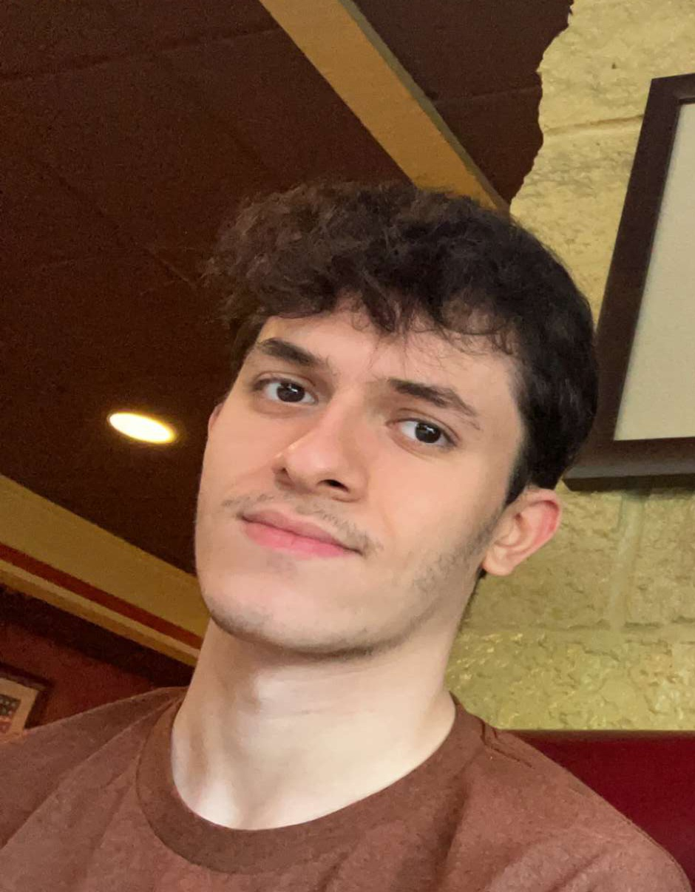

# Web-Server-Programming-In-Class

### Web Server Programming Introduction

 

Hello! My name is Matt DiDomizio, and I am currently a computer science major with a minor in astronomy. I am in my second-to-last semester at New Paltz, and right now, the computer-related courses I am enrolled in are Web Server Programming, Discrete & Continuous Computer Algorithms, and Computer-Aided Design I. I have previously taken a multitude of computer science courses, including Computer Science Foundations, Data Structures, Advanced Data Structures, Digital Logic, Object-Oriented Programming, Software Engineering, Discrete Mathematics for Computing, Operating Systems, and Assembly Language & Computer Architecture. Additionally, I have previously taken another CPS 493 course, Data Science, so Web Server Programming is an extra course I am taking out of interest in the subject. In the past, I worked on a cloud-based point of sale system as part of a collaborative project, and this piece software was created using technologies such as HTML, CSS, JavaScript, PHP, SQL, phpMyAdmin, Visual Studio Code, and GitHub. I also collaborated on a data science project in which a MapReduce recommendation system was created using Python, Python data science modules, and Hadoop. Other programming languages I am familiar with and have used in the past include Java, C/C++, and Lua. Another related experience I am involved in now is an internship in which I am aiding in creating coding courses for the younger generations. 

Especially after my experience creating a point-of-sale system for the web, I have been interested in gaining a more concrete understanding of web development methodologies and technologies. Web Server Programming seems to be a course which can introduce these new concepts and will also bring a practical, real-world angle to this area of computer science. This is very relevant not only to future internships I may take part in, but taking part in a course such as this also prepares me in a way that opens up doors for web-related jobs in the future. I am open to trying many different avenues of computer science as a career, and full-stack web development is already quite interesting to me, thus considering there are many positions in this field looking for talented individuals, I feel it would behoove me to develop my skills even further. I assuredly look forward to what this course has to offer. 